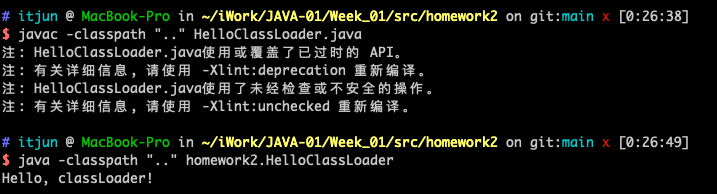
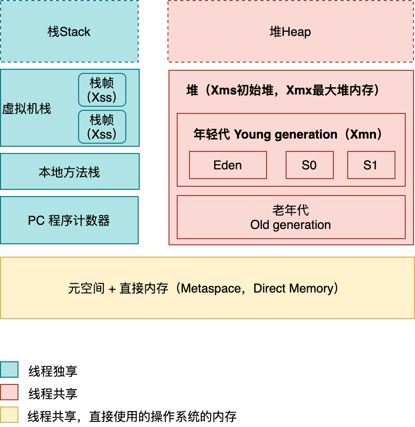

# 第一周 学习笔记

1（可选）、自己写一个简单的 Hello.java，里面需要涉及基本类型，四则运行，if 和for，然后自己分析一下对应的字节码，有问题群里讨论。

2（必做）、自定义一个 Classloader，加载一个 Hello.xlass 文件，执行 hello 方法， 此文件内容是一个 Hello.class 文件所有字节（x=255-x）处理后的文件。文件群里提供。

3（必做）、画一张图，展示 Xmx、Xms、Xmn、Metaspache、Direct Memory、Xss这些内存参数的关系。

4（可选）、检查一下自己维护的业务系统的 JVM 参数配置，用 jstat 和 jstack、jmap 查看一下详情，并且自己独立分析一下大概情况，思考有没有不合理的地方，如何改进。

注意：

1、对于线上有流量的系统，慎重使用jmap命令。

2、如果没有线上系统，可以自己 run 一个 web/java 项目。或者直接查看idea进程。

## homework-1

### 源码

[Hello.java](src/homework1/Hello.java)

### 字节码

```bash
# 生成 class 文件
javac Hello.java
# 生成字节码
javap -c -v Hello.class
# 内容重定向到指定文件
javap -c -v Hello.class >> HelloClassCodeAnalysis.md
```

[HelloClassCodeAnalysis.md](src/homework1/HelloClassAnalysis.md)

## homework-2

### 源码

[HelloClassLoader.java](src/homework2/HelloClassLoader.java)

### 运行

```bash
cd src/homework2
# 编译
javac -classpath ".." HelloClassLoader.java 
# 执行
java -classpath ".." homework2.HelloClassLoader
# 输出 Hello, classLoader!
```



## homework-3

Xmx : 堆的最大可用内存大小

Xms：堆的初始内存大小

Xmn：年轻代大小

Metaspache：元空间大小

Direct Memory：直接内存

内存模型




### 画图工具

https://app.diagrams.net/

## Homework-4

1. idea 运行一个死锁的 java 进程 [JStackTest.java](src/homework4/JStackTest.java)
2. 查看当前的java进程ID`jps`
3. 

4. jmap 在jdk11上没有 jmap -heap [pid] 的选项了，暂不记录，换成Windows的jdk8进行测试。
5. jstack 查看一个 idea 运行一个死锁的 java 进程`jstack -l 7056 >> jstack.log`

```java
2021-01-15 01:32:28
Full thread dump Java HotSpot(TM) 64-Bit Server VM (11.0.9+7-LTS mixed mode):

Threads class SMR info:
_java_thread_list=0x00007f8061d35510, length=15, elements={
0x00007f8062048000, 0x00007f8063810000, 0x00007f806280e800, 0x00007f8062814800,
0x00007f806385e000, 0x00007f806387f000, 0x00007f8063068000, 0x00007f80628df000,
0x00007f806394a000, 0x00007f80628df800, 0x00007f8063951000, 0x00007f80630cf000,
0x00007f8063956000, 0x00007f8063959000, 0x00007f80628f3000
}

"Reference Handler" #2 daemon prio=10 os_prio=31 cpu=0.89ms elapsed=1042.82s tid=0x00007f8062048000 nid=0x4703 waiting on condition  [0x000070000a829000]
   java.lang.Thread.State: RUNNABLE
	at java.lang.ref.Reference.waitForReferencePendingList(java.base@11.0.9/Native Method)
	at java.lang.ref.Reference.processPendingReferences(java.base@11.0.9/Reference.java:241)
	at java.lang.ref.Reference$ReferenceHandler.run(java.base@11.0.9/Reference.java:213)

   Locked ownable synchronizers:
	- None

"Finalizer" #3 daemon prio=8 os_prio=31 cpu=0.45ms elapsed=1042.82s tid=0x00007f8063810000 nid=0x3503 in Object.wait()  [0x000070000a92c000]
   java.lang.Thread.State: WAITING (on object monitor)
	at java.lang.Object.wait(java.base@11.0.9/Native Method)
	- waiting on <0x00000007800e2970> (a java.lang.ref.ReferenceQueue$Lock)
	at java.lang.ref.ReferenceQueue.remove(java.base@11.0.9/ReferenceQueue.java:155)
	- waiting to re-lock in wait() <0x00000007800e2970> (a java.lang.ref.ReferenceQueue$Lock)
	at java.lang.ref.ReferenceQueue.remove(java.base@11.0.9/ReferenceQueue.java:176)
	at java.lang.ref.Finalizer$FinalizerThread.run(java.base@11.0.9/Finalizer.java:170)

   Locked ownable synchronizers:
	- None

"Signal Dispatcher" #4 daemon prio=9 os_prio=31 cpu=1.72ms elapsed=1042.79s tid=0x00007f806280e800 nid=0xa803 runnable  [0x0000000000000000]
   java.lang.Thread.State: RUNNABLE

   Locked ownable synchronizers:
	- None

"C2 CompilerThread0" #5 daemon prio=9 os_prio=31 cpu=92.37ms elapsed=1042.79s tid=0x00007f8062814800 nid=0x5603 waiting on condition  [0x0000000000000000]
   java.lang.Thread.State: RUNNABLE
   No compile task

   Locked ownable synchronizers:
	- None

"C1 CompilerThread0" #7 daemon prio=9 os_prio=31 cpu=148.06ms elapsed=1042.79s tid=0x00007f806385e000 nid=0xa403 waiting on condition  [0x0000000000000000]
   java.lang.Thread.State: RUNNABLE
   No compile task

   Locked ownable synchronizers:
	- None

"Sweeper thread" #8 daemon prio=9 os_prio=31 cpu=2.21ms elapsed=1042.79s tid=0x00007f806387f000 nid=0xa203 runnable  [0x0000000000000000]
   java.lang.Thread.State: RUNNABLE

   Locked ownable synchronizers:
	- None

"Common-Cleaner" #9 daemon prio=8 os_prio=31 cpu=4.00ms elapsed=1042.71s tid=0x00007f8063068000 nid=0x5a03 in Object.wait()  [0x000070000afc4000]
   java.lang.Thread.State: TIMED_WAITING (on object monitor)
	at java.lang.Object.wait(java.base@11.0.9/Native Method)
	- waiting on <0x0000000780148a88> (a java.lang.ref.ReferenceQueue$Lock)
	at java.lang.ref.ReferenceQueue.remove(java.base@11.0.9/ReferenceQueue.java:155)
	- waiting to re-lock in wait() <0x0000000780148a88> (a java.lang.ref.ReferenceQueue$Lock)
	at jdk.internal.ref.CleanerImpl.run(java.base@11.0.9/CleanerImpl.java:148)
	at java.lang.Thread.run(java.base@11.0.9/Thread.java:834)
	at jdk.internal.misc.InnocuousThread.run(java.base@11.0.9/InnocuousThread.java:134)

   Locked ownable synchronizers:
	- None

"JDWP Transport Listener: dt_socket" #10 daemon prio=10 os_prio=31 cpu=10.80ms elapsed=1042.61s tid=0x00007f80628df000 nid=0x5d03 runnable  [0x0000000000000000]
   java.lang.Thread.State: RUNNABLE

   Locked ownable synchronizers:
	- None

"JDWP Event Helper Thread" #11 daemon prio=10 os_prio=31 cpu=18.52ms elapsed=1042.61s tid=0x00007f806394a000 nid=0x5e03 runnable  [0x0000000000000000]
   java.lang.Thread.State: RUNNABLE

   Locked ownable synchronizers:
	- None

"JDWP Command Reader" #12 daemon prio=10 os_prio=31 cpu=4.40ms elapsed=1042.61s tid=0x00007f80628df800 nid=0x6103 runnable  [0x0000000000000000]
   java.lang.Thread.State: RUNNABLE

   Locked ownable synchronizers:
	- None

"Service Thread" #13 daemon prio=9 os_prio=31 cpu=0.07ms elapsed=1041.26s tid=0x00007f8063951000 nid=0x6403 runnable  [0x0000000000000000]
   java.lang.Thread.State: RUNNABLE

   Locked ownable synchronizers:
	- None

"t1" #14 prio=5 os_prio=31 cpu=28.52ms elapsed=1041.24s tid=0x00007f80630cf000 nid=0x6703 waiting on condition  [0x000070000b5d6000]
   java.lang.Thread.State: WAITING (parking)
	at jdk.internal.misc.Unsafe.park(java.base@11.0.9/Native Method)
	- parking to wait for  <0x00000007800c9258> (a java.util.concurrent.locks.ReentrantLock$NonfairSync)
	at java.util.concurrent.locks.LockSupport.park(java.base@11.0.9/LockSupport.java:194)
	at java.util.concurrent.locks.AbstractQueuedSynchronizer.parkAndCheckInterrupt(java.base@11.0.9/AbstractQueuedSynchronizer.java:885)
	at java.util.concurrent.locks.AbstractQueuedSynchronizer.acquireQueued(java.base@11.0.9/AbstractQueuedSynchronizer.java:917)
	at java.util.concurrent.locks.AbstractQueuedSynchronizer.acquire(java.base@11.0.9/AbstractQueuedSynchronizer.java:1240)
	at java.util.concurrent.locks.ReentrantLock.lock(java.base@11.0.9/ReentrantLock.java:267)
	at homework4.JStackTest.doSomething(JStackTest.java:25)
	at homework4.JStackTest.run(JStackTest.java:16)

   Locked ownable synchronizers:
	- <0x00000007800c9228> (a java.util.concurrent.locks.ReentrantLock$NonfairSync)

"t2" #15 prio=5 os_prio=31 cpu=20.40ms elapsed=1041.24s tid=0x00007f8063956000 nid=0x6803 waiting on condition  [0x000070000b6d9000]
   java.lang.Thread.State: WAITING (parking)
	at jdk.internal.misc.Unsafe.park(java.base@11.0.9/Native Method)
	- parking to wait for  <0x00000007800c9228> (a java.util.concurrent.locks.ReentrantLock$NonfairSync)
	at java.util.concurrent.locks.LockSupport.park(java.base@11.0.9/LockSupport.java:194)
	at java.util.concurrent.locks.AbstractQueuedSynchronizer.parkAndCheckInterrupt(java.base@11.0.9/AbstractQueuedSynchronizer.java:885)
	at java.util.concurrent.locks.AbstractQueuedSynchronizer.acquireQueued(java.base@11.0.9/AbstractQueuedSynchronizer.java:917)
	at java.util.concurrent.locks.AbstractQueuedSynchronizer.acquire(java.base@11.0.9/AbstractQueuedSynchronizer.java:1240)
	at java.util.concurrent.locks.ReentrantLock.lock(java.base@11.0.9/ReentrantLock.java:267)
	at homework4.JStackTest.doSomething(JStackTest.java:38)
	at homework4.JStackTest.run(JStackTest.java:16)

   Locked ownable synchronizers:
	- <0x00000007800c9258> (a java.util.concurrent.locks.ReentrantLock$NonfairSync)

"DestroyJavaVM" #16 prio=5 os_prio=31 cpu=280.88ms elapsed=1041.24s tid=0x00007f8063959000 nid=0x2903 waiting on condition  [0x0000000000000000]
   java.lang.Thread.State: RUNNABLE

   Locked ownable synchronizers:
	- None

"Attach Listener" #17 daemon prio=9 os_prio=31 cpu=92.63ms elapsed=777.64s tid=0x00007f80628f3000 nid=0xa90b waiting on condition  [0x0000000000000000]
   java.lang.Thread.State: RUNNABLE

   Locked ownable synchronizers:
	- None

"VM Thread" os_prio=31 cpu=97.65ms elapsed=1042.83s tid=0x00007f8063063800 nid=0x3203 runnable  

"GC Thread#0" os_prio=31 cpu=30.91ms elapsed=1042.85s tid=0x00007f806200a000 nid=0x5103 runnable  

"GC Thread#1" os_prio=31 cpu=26.81ms elapsed=391.50s tid=0x00007f8063857800 nid=0x9a03 runnable  

"GC Thread#2" os_prio=31 cpu=18.71ms elapsed=391.50s tid=0x00007f80638c0000 nid=0x6b03 runnable  

"G1 Main Marker" os_prio=31 cpu=0.69ms elapsed=1042.85s tid=0x00007f8063832800 nid=0x2d03 runnable  

"G1 Conc#0" os_prio=31 cpu=0.04ms elapsed=1042.85s tid=0x00007f8063833000 nid=0x2e03 runnable  

"G1 Refine#0" os_prio=31 cpu=0.81ms elapsed=1042.85s tid=0x00007f806305e000 nid=0x4c03 runnable  

"G1 Young RemSet Sampling" os_prio=31 cpu=154.30ms elapsed=1042.85s tid=0x00007f806305e800 nid=0x4a03 runnable  
"VM Periodic Task Thread" os_prio=31 cpu=781.23ms elapsed=1041.25s tid=0x00007f80620dc000 nid=0x9e03 waiting on condition  

JNI global refs: 35, weak refs: 968


Found one Java-level deadlock:
=============================
"t1":
  waiting for ownable synchronizer 0x00000007800c9258, (a java.util.concurrent.locks.ReentrantLock$NonfairSync),
  which is held by "t2"
"t2":
  waiting for ownable synchronizer 0x00000007800c9228, (a java.util.concurrent.locks.ReentrantLock$NonfairSync),
  which is held by "t1"

Java stack information for the threads listed above:
===================================================
"t1":
	at jdk.internal.misc.Unsafe.park(java.base@11.0.9/Native Method)
	- parking to wait for  <0x00000007800c9258> (a java.util.concurrent.locks.ReentrantLock$NonfairSync)
	at java.util.concurrent.locks.LockSupport.park(java.base@11.0.9/LockSupport.java:194)
	at java.util.concurrent.locks.AbstractQueuedSynchronizer.parkAndCheckInterrupt(java.base@11.0.9/AbstractQueuedSynchronizer.java:885)
	at java.util.concurrent.locks.AbstractQueuedSynchronizer.acquireQueued(java.base@11.0.9/AbstractQueuedSynchronizer.java:917)
	at java.util.concurrent.locks.AbstractQueuedSynchronizer.acquire(java.base@11.0.9/AbstractQueuedSynchronizer.java:1240)
	at java.util.concurrent.locks.ReentrantLock.lock(java.base@11.0.9/ReentrantLock.java:267)
	at homework4.JStackTest.doSomething(JStackTest.java:25)
	at homework4.JStackTest.run(JStackTest.java:16)
"t2":
	at jdk.internal.misc.Unsafe.park(java.base@11.0.9/Native Method)
	- parking to wait for  <0x00000007800c9228> (a java.util.concurrent.locks.ReentrantLock$NonfairSync)
	at java.util.concurrent.locks.LockSupport.park(java.base@11.0.9/LockSupport.java:194)
	at java.util.concurrent.locks.AbstractQueuedSynchronizer.parkAndCheckInterrupt(java.base@11.0.9/AbstractQueuedSynchronizer.java:885)
	at java.util.concurrent.locks.AbstractQueuedSynchronizer.acquireQueued(java.base@11.0.9/AbstractQueuedSynchronizer.java:917)
	at java.util.concurrent.locks.AbstractQueuedSynchronizer.acquire(java.base@11.0.9/AbstractQueuedSynchronizer.java:1240)
	at java.util.concurrent.locks.ReentrantLock.lock(java.base@11.0.9/ReentrantLock.java:267)
	at homework4.JStackTest.doSomething(JStackTest.java:38)
	at homework4.JStackTest.run(JStackTest.java:16)

Found 1 deadlock.


```

6. jstat 统计 idea 的gc情况`jstat -gc -h3 33778 1000 10`
7. 

