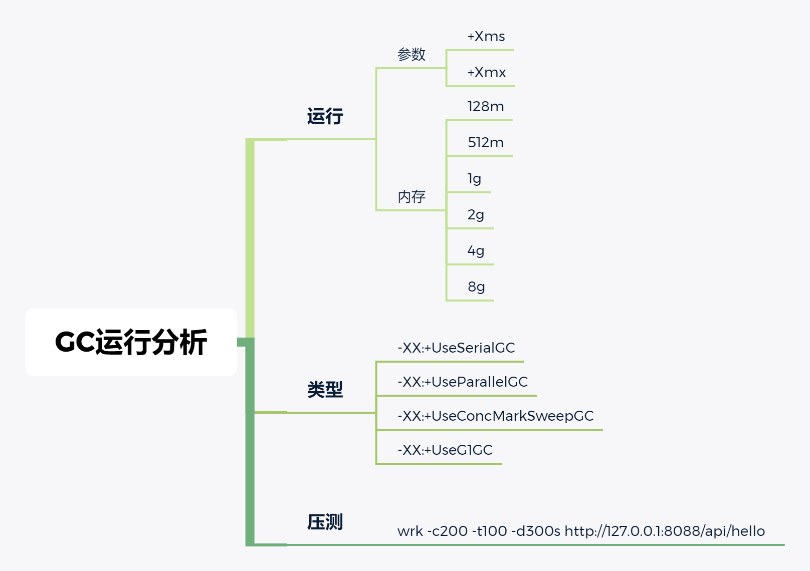
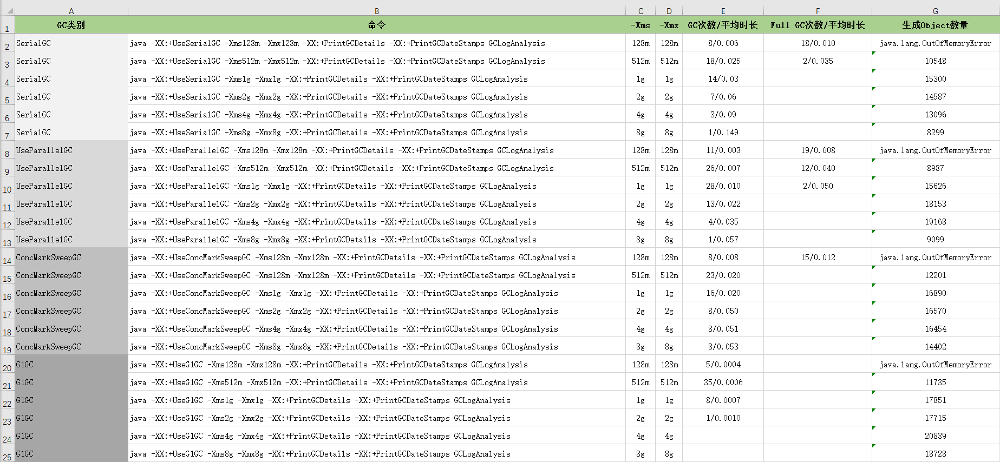

# 第二周 课程作业

【周三作业题目】

1、使用 GCLogAnalysis.java 自己演练一遍串行/并行/CMS/G1的案例。 

2、使用压测工具（wrk或sb），演练gateway-server-0.0.1-SNAPSHOT.jar示例。 

3、(选做)如果自己本地有可以运行的项目，可以按照2的方式进行演练。 

4、(必做)根据上述自己对于1和2的演示，写一段对于不同GC和堆内存的总结，提交到 github。

【周日作业题目】

**1.（选做）**运行课上的例子，以及 Netty 的例子，分析相关现象。

**2.（必做）**写一段代码，使用 HttpClient 或 OkHttp 访问 [http://localhost:8801 ](http://localhost:8801/)，代码提交到 Github。

## 周三作业

### GC参数运行分析

### GC运行对比

### GC运行结论

同一GC，内存增大：

1. 类生产数量 增加---临界值---减少 
2. GC数量变化 增加---临界值---减少
3. GC平均时间 增加---临界值---增加

不同GC，统一内存：

1. GC的次数   UseParallel > ConcMarkSweep > Serial > G1 

2. 类生产数量 G1 > UseParallel > ConcMarkSweep >=  Serial