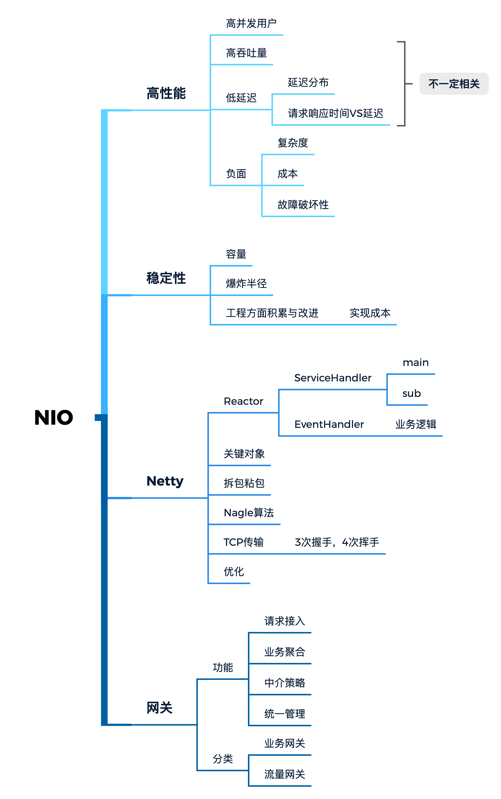

# 第3课 课程作业

## 思维导图



## 完成功能

1. 过滤器实现和优先级配置
2. 路由器的实现和代理转发
3. 负载均衡策略实现
   1. 随机策略
   2. 轮询策略
   3. 权重策略

## 调用实现

```bash
curl "http://127.0.0.1/api/hello"
```

实际指向：127.0.0.1:8088/api/hello


```bash
curl "http://127.0.0.1/qimen/router.incr"
```

实际指向奇门项目的获取订单接口--测试接口


## 改进目标

1. 路由器支持不同的请求参数method，代理转发到不同的实现服务器
2. 支持参数校验和post代理转发
3. 参考奇门仓储的实现网关方式，自己实现一个发起方和接收方