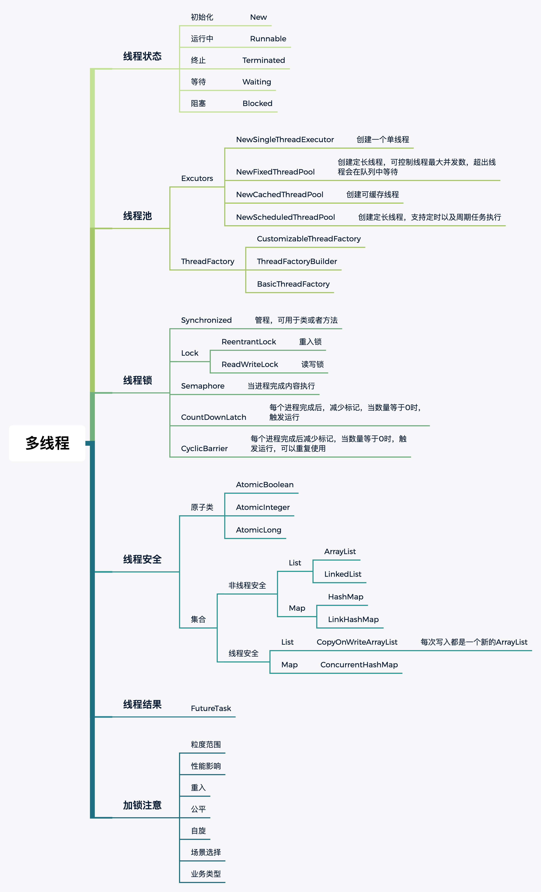

# Week04_Homework
## 作业一
思考有多少种方式，在main函数启动一个新线程或线程池， 异步运行一个方法，拿到这个方法的返回值后，退出主线程. 写出你的方法，越多越好，提交到github。

1. [While](src/main/java/io/itjun/week4/Demo1While.java) 通过循环获取
1. [Join](src/main/java/io/itjun/week4/Demo2Join.java) 使用Join等待
1. [Synchronized](src/main/java/io/itjun/week4/Demo3Synchronized.java) 使用管程
1. [Sleep](src/main/java/io/itjun/week4/Demo4Sleep.java) 使用睡眠等待
1. [Semaphore](src/main/java/io/itjun/week4/Demo5Semaphore.java) 使用Semaphore
1. [ReentrantLock](src/main/java/io/itjun/week4/Demo6ReentrantLock.java) 使用重入锁
1. [CountDownLatch](src/main/java/io/itjun/week4/Demo7CountDownLatch.java) 使用CountDownLatch
1. [FutureTask](src/main/java/io/itjun/week4/Demo8FutureTask.java) 使用FutureTask
1. [CyclicBarrier](src/main/java/io/itjun/week4/Demo9CyclicBarrier.java) 使用CyclicBarrier
1. [CompletableFuture](src/main/java/io/itjun/week4/Demo10CompletableFuture.java) 使用CompletableFuture

## 多线程思维导图

