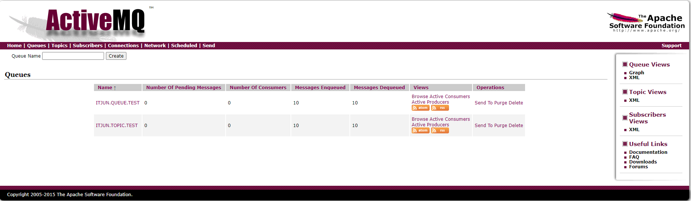

# ActiveMQ

docker 启动

获取镜像

```shell
docker pull webcenter/activemq
```

### 启动运行
```shell
docker run -d -p 8161:8161 -p 61616:61616 -e ACTIVEMQ_ADMIN_LOGIN=admin -e ACTIVEMQ_ADMIN_PASSWORD=admin --restart=always --name activemq webcenter/activemq
```

后台地址
```aidl
http://127.0.0.1:8161/
admin
admin
```

### 运行结果

